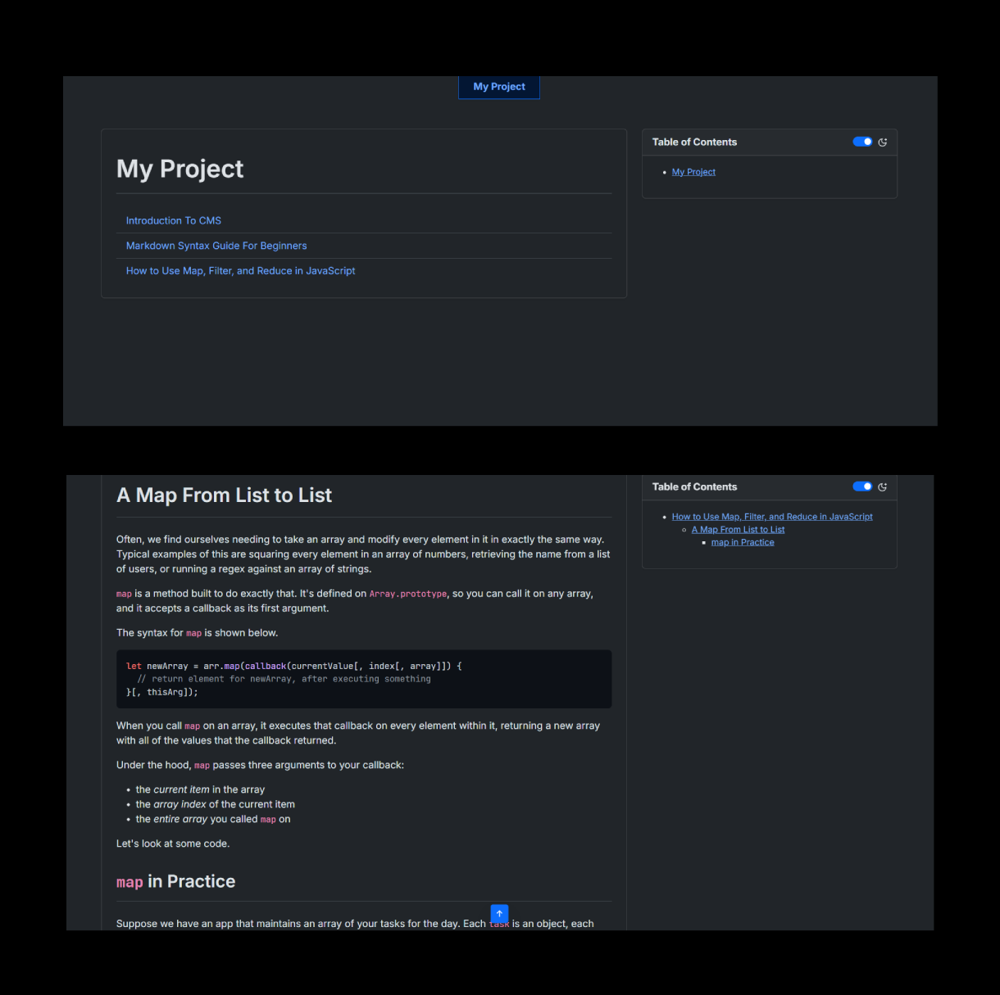

# MD-TO-HTML.js

> Easily convert your markdown notes into html websites.

## Table of Contents

1. [Usage](#usage)
    1. [Pre-requisite](#pre-requisite)
    2. [Folder Structure](#folder-structure)
    3. [Installing Neccessary Dependencies](#installing-neccessary-dependencies)
    4. [Build Your HTML Website](#build-your-html-website)
    5. [Build Using CLI (Alternative Mehtod)](#build-using-cli)
2. [Serve Your Website](#serve-your-website)
3. [Features](#features)

## Usage

### Pre-requisite

-   You should have `Node.js` installed on your pc.
-   Install `Browser-Sync` or `Servor` package globally, if you want to view your html website on multiple devices.
-   And the you're good to go!

### Folder Structure

Folder structure can be anyhting because when you run the script it will ask you all the details. Currently I am using the following folder structure. I have my markdown notes in `notes/` folder and images in `imgs/` folder (**NOTE:** If you want to have images in markdown then it is mandatory to have all your images in `imgs/` folder, this is mandatory). And I have copied the `md-to-html.js` script from the repo.

```
my-project/
|-- md-to-html.js
`-- notes/
    |-- 01-introduction-to-cms.md
    |-- 02-markdown-syntax.md
    |-- 03-how-to-use-map-filter-reduce-in-js.md
    `-- imgs/
        `-- markdown-syntax-guide.jpg
```

### Installing Neccessary Dependencies

The first thing that you need to do is:

1. Open terminal and go to `my-project/`.

    ```sh
    cd my-project
    ```

2. Initialize it as a npm project as we need some dependencies.

    ```sh
    npm init -y
    ```

3. Install the neccesary dependencies, you can check the dependencies in github repo's `package.json` dependencies or directly run the below code.

    ```sh
    npm i marked marked-gfm-heading-id
    ```

### Build Your HTML Website

Once your project is ready - you follow the same folder structure as shown above and have installed all the neccessary dependencies. You're ready to build your html website using your markdown files.

Open `package.json` and update the following settings:

```json
{
    "type": "module",
    "scripts": {
        "build": "node md-to-html.js"
    }
}
```

And in `md-to-html.js` file, you will find the `GLOBAL DEFAULTS` section. Update it according to your need, here we will update as per our above example.

```js
// ===== GLOBAL DEFAULTS =====
const inputDirDefault = "notes";
const outputDirDefault = "public";
const superHeadingDefault = "My Project";
```

**Now we're ready to build our website.** Open your `my-project` folder in the terminal and run:

```sh
npm run build
```

The moment you type the above command it will run our `md-to-html.js` file will our default values. Thus, you don't need to enter anything just keep on pressing enter.

```
> md-to-html-automation@1.0.0 build
> node md-to-html.js


--- Markdown to HTML Converter Setup ---
Enter input directory for Markdown files (notes):
Enter output directory for HTML files (public):
Use inline CSS & JS (yes/no)? (yes):
Enter super heading for your pages (My Project):
```

And your website will be built.

```
--- Starting Conversion ---
Input Directory: notes
Output Directory: public
Use inline css and js: true
Super Heading: My Project
---------------------------

Copied 'imgs' folder to: public\imgs
Converted 01-introduction-to-cms.md -> public\01-introduction-to-cms.html
Converted 02-markdown-syntax.md -> public\02-markdown-syntax.html
Converted 03-how-to-use-map-filter-reduce-in-js.md -> public\03-how-to-use-map-filter-reduce-in-js.html
Generated index.html in public
```

**Badhai Ho!** (_Congrats_)

### Build Using CLI

Alternatively you can also run from cli and pass arguments like below (In this it won't ask you any questions as you have passed all args):

```sh
node md-to-html.js notes dist "#100Days_of_ML" true
```

## Serve Your Website

### Locally

Now you can serve your files using `browser-sync` or `servor` or `live-server` package (it's upto you).

`Recommended: Browser-Sync` [How to install & use browser-sync](https://browsersync.io/docs)

```sh
$ browser-sync public
[Browsersync] Access URLs:
 -------------------------------------
       Local: http://localhost:3000
    External: http://192.168.56.1:3000
 -------------------------------------
          UI: http://localhost:3001
 UI External: http://localhost:3001
 -------------------------------------
[Browsersync] Serving files from: C:\Users\Avite\Documents\Avinash\my-project\public
```

One GREAT thing about browser sync about `browser-sync` is that it exposes the `port` to all the devices connected to the same network implies if your pc and tablet are connected to the same network then you will be able to access your notes website from tablet as well using the `External` url provided.



### Globally over Internet

Use these famous free hosting services:

-   Github Pages
-   Netlify

you can view the live version of our demo project at [Demo](https://md-to-html-js.netlify.app).

## Features

1. Dark Mode Toggle (using switch or `Shift + D`).
2. Automatic Table of Contents generation.
3. Sticky ToC.
4. Automatic `index.html` generation containing links to all the notes in the current folder.
5. Homepage can be accessed by clicking on the Super Heading.
6. `<title>` is dynamic using the first heading in each markdown.
7. Automatic code syntax highlighting, just mention the name of the language in the markdown after three backticks [Refer Markdown Cheatsheet](https://www.markdownguide.org/cheat-sheet/).
8. Fully Responsive on all devices.

## Todos Future

-   In `BASE`, script for generating inline css and inline js.
