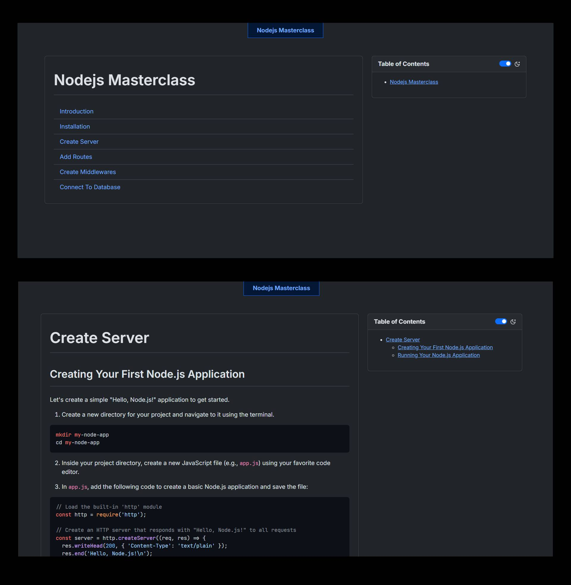

# MD-TO-HTML.js

> Easily convert your markdown notes into html websites.

## Table of Contents

1. [Usage](#usage)
2. [Features](#features)

## Usage

**Pre-requisite**

- You should have `Node.js` installed on your pc.
- Install `marked` package globally - `npm i -g marked`.
- Install `Browser-Sync` globally.
- And the you're good to go!


#### Folder Structure

Folder structure can be anyhting, as when you run the script it asks you all the things. Currently I am using the following folder structure for example:

```
my-notes/
├── markdowns/
│   ├── 01-introduction.md
│   ├── 02-installation.md
│   ├── 03-create-server.md
│   ├── 04-add-routes.md
│   ├── 05-create-middlewares.md
│   └── 06-connect-database.md
└── md-to-html.js
```

Each markdown file contains only basic markdown syntax. (*The output is styled using various css libraries.*). Example: `01-introduction.md` looks like below:

```md
# Introduction

Node.js has revolutionized the world of web development, enabling developers to build fast and scalable server-side applications using JavaScript. Whether you're a complete beginner or a front-end developer looking to explore back-end development, this step-by-step guide will introduce you to Node.js and help you get started. We'll cover the basics, set up your development environment, and create a simple Node.js application with detailed examples.

### What is Node.js?

Node.js is an open-source, cross-platform JavaScript runtime environment that allows developers to run JavaScript code on the server side. It's built on the V8 JavaScript engine, which is the same engine used by Google Chrome. Node.js is designed to be lightweight, efficient, and non-blocking, making it ideal for building real-time, data-intensive applications.
```

To run the command, make sure you're in your current project folder in the terminal:

```sh
cd my-notes/
```

Run the `md-to-html.js` file using node:

```sh
node md-to-html.js
```

Then it ask you the following questions:

```
--- Markdown to HTML Converter Setup ---
Enter input directory for Markdown files (.): markdowns
Enter output directory for HTML files (markdowns):
Use CDN for custom CSS/JS (yes/no)? (yes):
Enter super heading for your pages (Notes): Nodejs Masterclass
```

You can also specify a different folder if you want your html files to be in a seperate folder.

> **NOTE:** Use CDN should be always left blank that is it should always `yes` only if you are contributer and you have cloned this repo then only it will work. Otherwise for usage just use cdn.

And it will automatically generate all your html files.

```
--- Markdown to HTML Converter Setup ---
Enter input directory for Markdown files (.): markdowns
Enter output directory for HTML files (markdowns):
Use CDN for custom CSS/JS (yes/no)? (yes):
Enter super heading for your pages (Notes): Nodejs Masterclass

--- Starting Conversion ---
Input Directory: markdowns
Output Directory: markdowns
Use Custom CDN for style.css/main.js: true
Super Heading: Nodejs Masterclass
---------------------------

Converted 01-introduction.md -> markdowns\01-introduction.html
Converted 02-installation.md -> markdowns\02-installation.html
Converted 03-create-server.md -> markdowns\03-create-server.html
Converted 04-add-routes.md -> markdowns\04-add-routes.html
Converted 05-create-middlewares.md -> markdowns\05-create-middlewares.html
Converted 06-connect-database.md -> markdowns\06-connect-database.html
Generated index.html in markdowns
```

Now you can serve your files using `browser-sync` or `servor` or `live-server` package (it's your choice). *Recommended: Browser-Sync* [How to install & use browser-sync](https://browsersync.io/docs)

```sh
$ browser-sync markdowns
[Browsersync] Access URLs:
 -------------------------------------
       Local: http://localhost:3000
    External: http://192.168.56.1:3000
 -------------------------------------
          UI: http://localhost:3001
 UI External: http://localhost:3001
 -------------------------------------
[Browsersync] Serving files from: C:\Users\Avite\Documents\Avinash\MASTER\md-to-html-automation\markdowns
```

Now if your pc and tablet are connected to the same network then you will be able to access your notes from tablet as well using the `External` url provided.



## Features

1. Dark Mode Toggle (using switch or `Shift + D`).
2. Automatic Table of Contents generation.
3. Sticky ToC.
4. Automatic `index.html` generation containing links to all the notes in the current folder.
5. Homepage can be accessed by clicking on the Super Heading.
6. `<title>` is dynamic using the first heading in each markdown.
7. Automatic code syntax highlighting, just mention the name of the language in the markdown after three backticks [Refer Markdown Cheatsheet](https://www.markdownguide.org/cheat-sheet/).
8. Fully Responsive on all devices.